# X-Ray Images Enhancement

## Abstract
The main objective of this project is to improve the visualization of fractured bones using three image enhancement algorithms: **contrast limited adaptive histogram equalization** (CLAHE), **unsharp masking** (UM) and  **high-frequency emphasis filtering** (HEF) After implementing these algorithms, we will discuss about the results and the difficulties found during the development of the project.

## Example Image


##### Courtesy: National Science Foundation

Unprocessed images of x-ray films, like this one of a chest, made by *Nikola Zivaljevic, M.D.* and found at the [National Sciente Foundation Multimedia Gallery](https://www.nsf.gov/news/mmg/mmg_disp.jsp?med_id=52110), will be used in this project.

## Images Source

Besides the first image (001.tif), found at the [National Sciente Foundation Multimedia Gallery](https://www.nsf.gov/news/mmg/mmg_disp.jsp?med_id=52110), all the other images used were founded at the [National Library of Medicine MedPix](https://medpix.nlm.nih.gov/home), a free open source database with over 59,000 indexed and curated images, organized, reviewed, approved, and curated free of charge for personal use and for local teaching at institutions.

# X-Ray Images Enhancement - Final Report

## Unsharp Masking

Unsharp masking is a linear filter that is capable of amplify high-frequencies of an image. The first registry of this technique was made in Germany, during the 30s, in order to get a better resolution for some photos. In modern days, the same filter is used as a feature in present's image editing software, like GIMP or Photoshop.

The first step of the algorithm is to copy the original image and apply a gaussian blur into it (Blur intensity is defined by a setting called **Radius**).\
If we subtract the blurred image from the original image, we will obtain only the edges created by the blur. This is what we call **unsharped mask**.\
Finally, the enhanced image is collected after applying the following formula:
```
sharpened image = original image + amount * (unsharped mask)
```
The **radius** setting is related to the blur intensity (as explained before) because it defines the size of the edges. The **amount** setting, on the other hand, controls the intensity of the edges (how much dark or light it will be).

### Results
Even though this technique is quite simple, it's also very powerful because we can have satisfying results with a linear time complexity O(n).

| Original Image  | Enhanced Image |
| ------------- | ------------- |
|   |   |
| 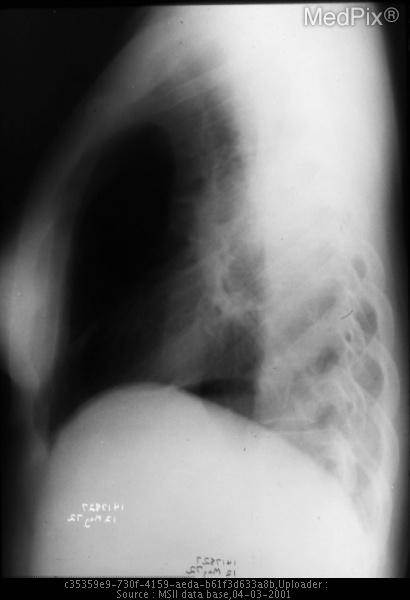  |   |
| 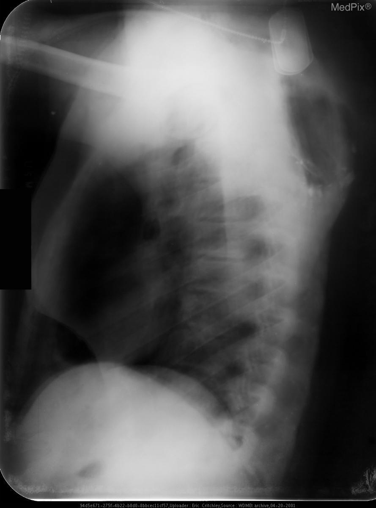  | 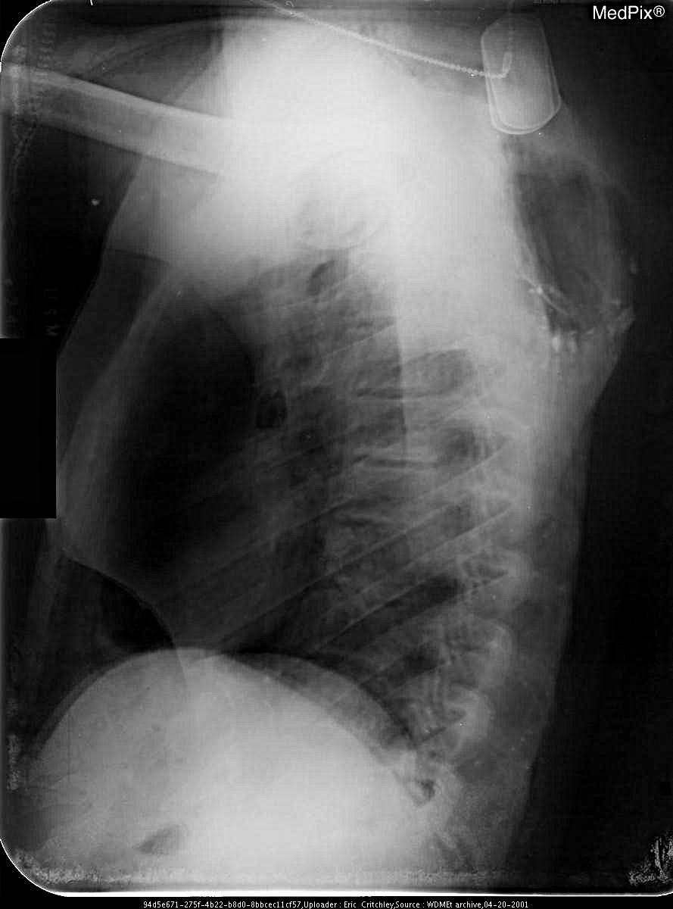  |
|   |   |
|   |   |

It's not really necessary to apply only the gaussian filter in order to get the unsharpened mask. In fact, the project also tested another filters studied at class:

| Original Image  | Gaussian Filter | Median Filter | Maximum Filter | Minimum Filter |
| ------------- | ------------- | ------------- | ------------- | ------------- |
|   |  |  |  | 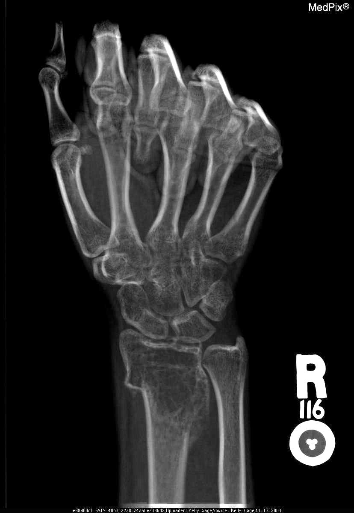 |

## CLAHE

The Contrast Limited Adaptive Histogram Equalization method is a histogram-based method used to improve contrast in images. This technique computes the histogram for the region around each pixel in the image, improving the local contrast and enhancing the edges in each region. Since AHE can overamplify noise in the image, CLAHE prevents this by limiting the amplification.

To apply CLAHE to the images, we first convert them to grayscale and then normalize. This approach is similar to [N-CLAHE](https://www.researchgate.net/publication/322004051_Image_enhancement_on_digital_x-ray_images_using_N-CLAHE), but we do not used a log normalization. After this step, the image is padded by reflecting the pixels in the borders, so we can process it all.

Then, to each pixel in the image, we calculate the clipped histogram for the region around it, i.e., we define the maximum number of occurrences a pixel should have. If the occurrence is greater than the clip limit, we cut the exceeding and redistribute to all pixels. To improve this technique, this process can be repeated a certain number of times.

With the clipped histogram, we calculate the probability of each pixel in it and compute the CDF (Cumulative Distribution Function), using the cumulative sum of the ordered pixels, and multiply each value of the function by 255, to limit the image's values to [0, 255]. Since these are float values, the floor operation is used.

After calculating the CDF, all pixels will have a transformation value. We now apply this transformation to the pixel in the center of the region.

This CLAHE implementation expects 3 inputs:
- Window size: size of the rectangular region around the pixel to be processed.
- Clip limit: maximum number of occurrences of the pixel in the histogram.
- Iterations: number of clipping iterations.

As we noticed by processing some images, when the clip limit is very high, the image become noisy. The explanation is that if the limit is very high, there is no clipping, so we fall back to an AHE algorithm.

### Results
Since CLAHE computes a histogram to each pixel, its complexity is very high and demands a lot of processing time to finish its task. We had difficulties implementing an optimized version, so the current version is the slow one.

Aside from the high cost, the enhanced image is much better than the unprocessed one, showing hidden features by enhancing its edges and amplifying its visibility. The parameters influenced a lot the results:

- Number of clipping iterations: can reduce noise in the image, but increases drastically the needed computational power and not in all cases it was useful.
- Window size: it was tested a wide range of values for this parameter, since it is the one that influences the most the result. We tested from 8 to 150 and the best one were in [40, 100].
- Clip limit : were tested values from 4 to 150. The best values that were found was 4 and 150, depending on window size and image. The main influence was in the histograms.

#### Comparison between images

To compare the effects of the parameters, several different runs were made with different parameters. The best combination we found was WS = 100, CL = 150 and IT = 1. Depending on the image, IT = 5 yields a great result, as in the Nonossifying Fibroma images. IT > 5 yielded no improvement in the tests. The results can be seen in the next tables.

- WS: window size
- CL: clip limit
- IT: clipping iterations

| Original | WS: 40, CL: 4, IT: 1 | Histogram |
| ------------- | ------------- | ------------- |
|   | 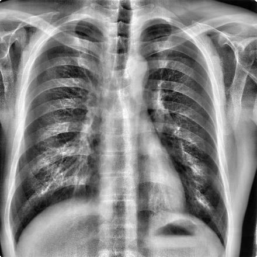  | 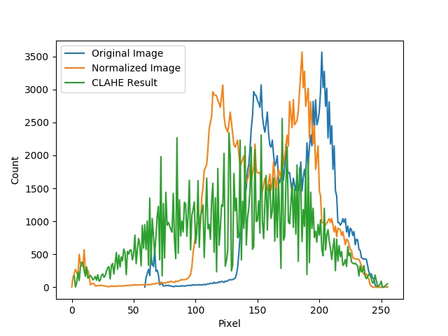  |

| Original | WS: 40, CL: 150, IT: 1 | Histogram |
| ------------- | ------------- | ------------- |
|  | 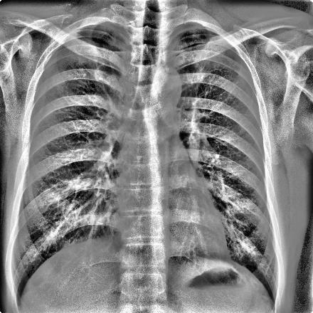 | 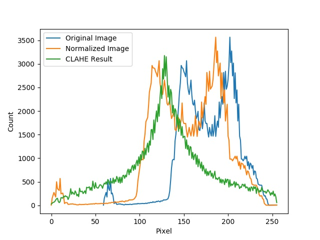 |

| Original | WS: 100, CL: 4, IT: 1 | Histogram |
| ------------- | ------------- | ------------- |
|  |  |  |

| Original | WS: 100, CL: 150, IT: 1 | Histogram |
| ------------- | ------------- | ------------- |
|  |  |  |

| Original | WS: 100, CL: 150, IT: 1 | Histogram |
| ------------- | ------------- | ------------- |
|  | 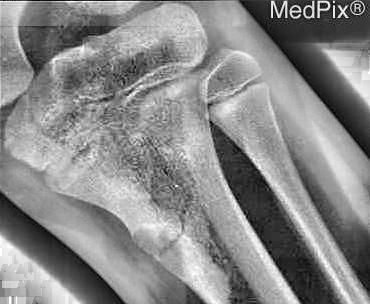 | 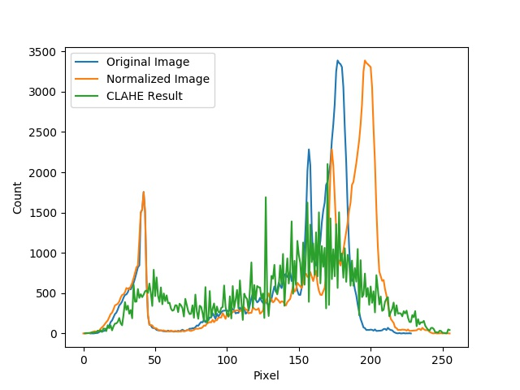 |
| Original | WS: 100, CL: 150, IT: 5 | Histogram |
|  |  | 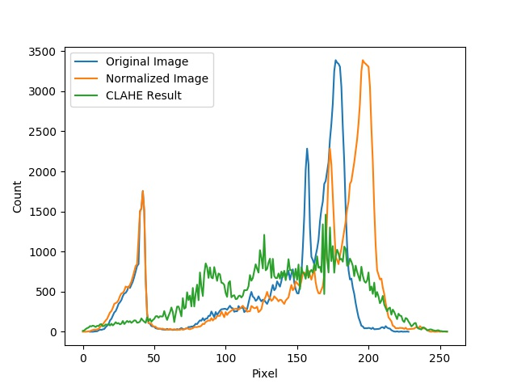 |

| Original | WS: 100, CL: 150, IT: 1 | Histogram |
| ------------- | ------------- | ------------- |
|  | 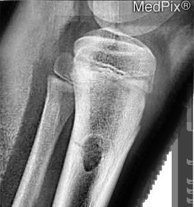 | 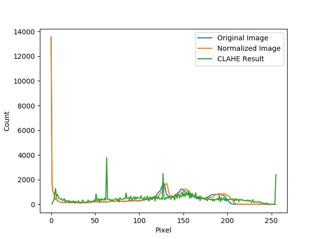 |

| Original | WS: 100, CL: 150, IT: 5 | Histogram |
| ------------- | ------------- | ------------- |
|  |  | 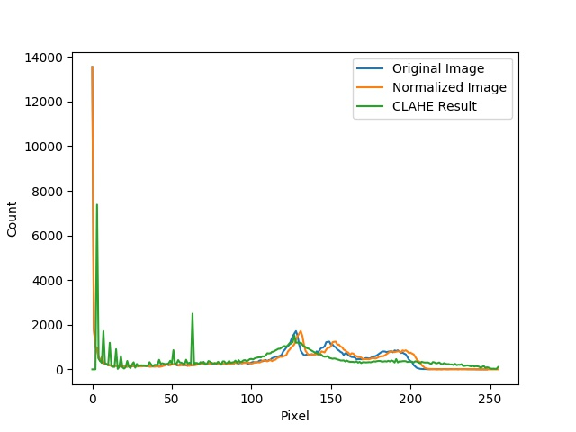 |

#### Other tested images

| Original | Enhanced |
| ------------- | ------------- |
|   | 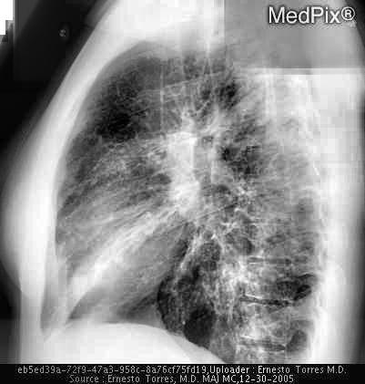  |
| 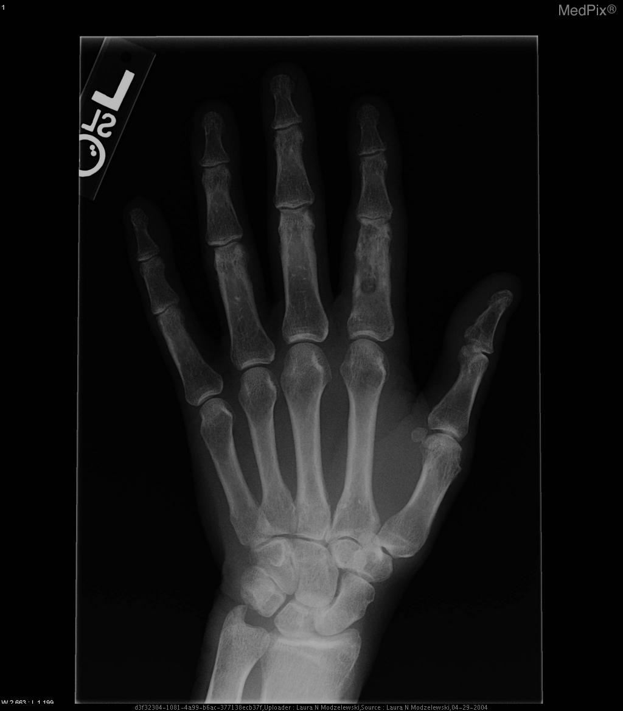 | 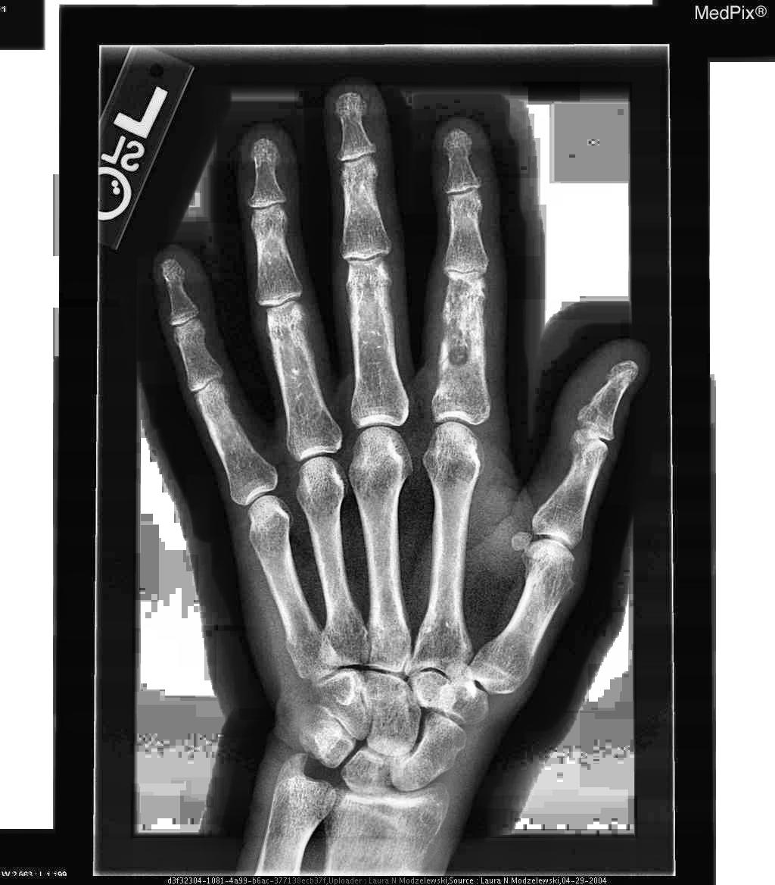 |

## Conclusion

For our algorithm's comparisons, we will use a [Toddler's Fracture of a Left Tibia](https://medpix.nlm.nih.gov/case?id=118ab4b1-3fa7-4ce8-b332-6b6ce0632d90) from a 3 years old pacient. Children ofter have injuries of the tibia and fibula in their lower limbs. 

| Original | UM  | HEF | CLAHE |
| ------------- | ------------- | ------------- | ------------- |
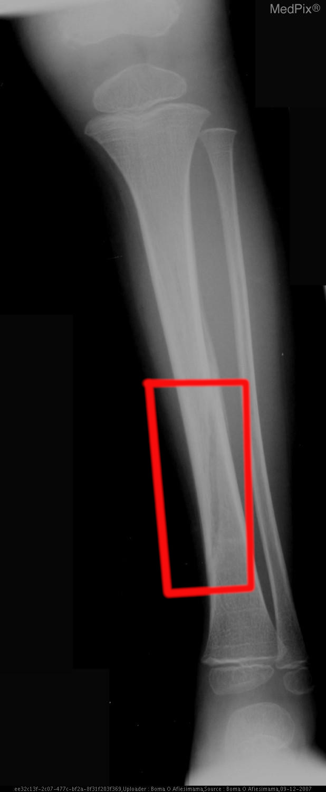 |  | SOON |  |

Two other images from the same case, a [Nonossifying Fibroma](https://medpix.nlm.nih.gov/case?id=410b3692-dd34-47f5-a97d-4b422ca02a96) from someone who got kicked in the shin while playing soccer, can also be used to check our results.

| Original | UM  | HEF | CLAHE |
| ------------- | ------------- | ------------- | ------------- |
 | 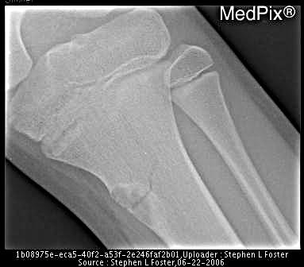 | SOON |  |

| Original | UM  | HEF | CLAHE |
| ------------- | ------------- | ------------- | ------------- |
 | 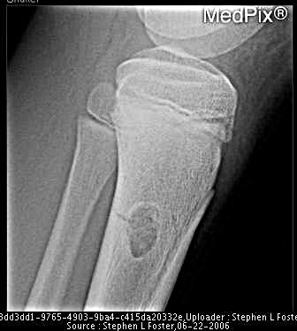 | SOON |  |

## Authors

- André Scheibel de Almada 9292952
- Cho Young Lim 6436060
- Eduardo Garcia Misiuk 9293230

# Dependencies
## Packages
### Python
`apt-get install python3`

### venv
`apt-get install python3-venv`

## Libraries
Setup the repository by following the instructions from [installation](installation) section.  
After activating the environment, run `pip install -r requirements.txt` to install the libraries.

# Installation
Clone the repository with `git clone https://github.com/asalmada/x-ray-images-enhancement`.  
Run `python3 -m venv x-ray-images-enhancement` to install the environment in the repository.

## Environment
To activate, run `source bin/activate` in Linux or `source Scripts/activate` in Windows.  
To deactivate, run `deactivate`.

# Demonstration
To run the demonstration, run `chmod 755 demo.sh` and then `./demo.sh`.