# X-Ray Images Enhancement

## Abstract
The main objective of this project is to improve the visualization of fractured bones using three image enhancement algorithms: **contrast limited adaptive histogram equalization** (CLAHE), **unsharp masking** (UM) and  **high-frequency emphasis filtering** (HEF) After implementing these algorithms, we will discuss about the results and the difficulties found during the development of the project.

## Example Image


##### Courtesy: National Science Foundation

Unprocessed images of x-ray films, like this one of a chest, made by *Nikola Zivaljevic, M.D.* and found at the [National Sciente Foundation Multimedia Gallery](https://www.nsf.gov/news/mmg/mmg_disp.jsp?med_id=52110), will be used in this project.

## Images Source

Besides the first image (001.tif), found at the [National Sciente Foundation Multimedia Gallery](https://www.nsf.gov/news/mmg/mmg_disp.jsp?med_id=52110), all the other images used were founded at the [National Library of Medicine MedPix](https://medpix.nlm.nih.gov/home), a free open source database with over 59,000 indexed and curated images, organized, reviewed, approved, and curated free of charge for personal use and for local teaching at institutions.

# X-Ray Images Enhancement - Final Report

## Unsharp Masking

Unsharp masking is a linear filter that is capable of amplify high-frequencies of an image. The first registry of this technique was made in Germany, during the 30s, in order to get a better resolution for some photos. In modern days, the same filter is used as a feature in present's image editing software, like GIMP or Photoshop.

The first step of the algorithm is to copy the original image and apply a gaussian blur into it (Blur intensity is defined by a setting called **Radius**).\
If we subtract the blurred image from the original image, we will obtain only the edges created by the blur. This is what we call **unsharped mask**.\
Finally, the enhanced image is collected after applying the following formula:
```
sharpened image = original image + amount * (unsharped mask)
```
The **radius** setting is related to the blur intensity (as explained before) because it defines the size of the edges. The **amount** setting, on the other hand, controls the intensity of the edges (how much dark or light it will be).

### Results
Even though this technique is quite simple, it's also very powerfull because we can have satisfying results with a linear time complexity O(n).

| Original Image  | Enhanced Image |
| ------------- | ------------- |
|   |   |
|   |   |
|   |   |
| 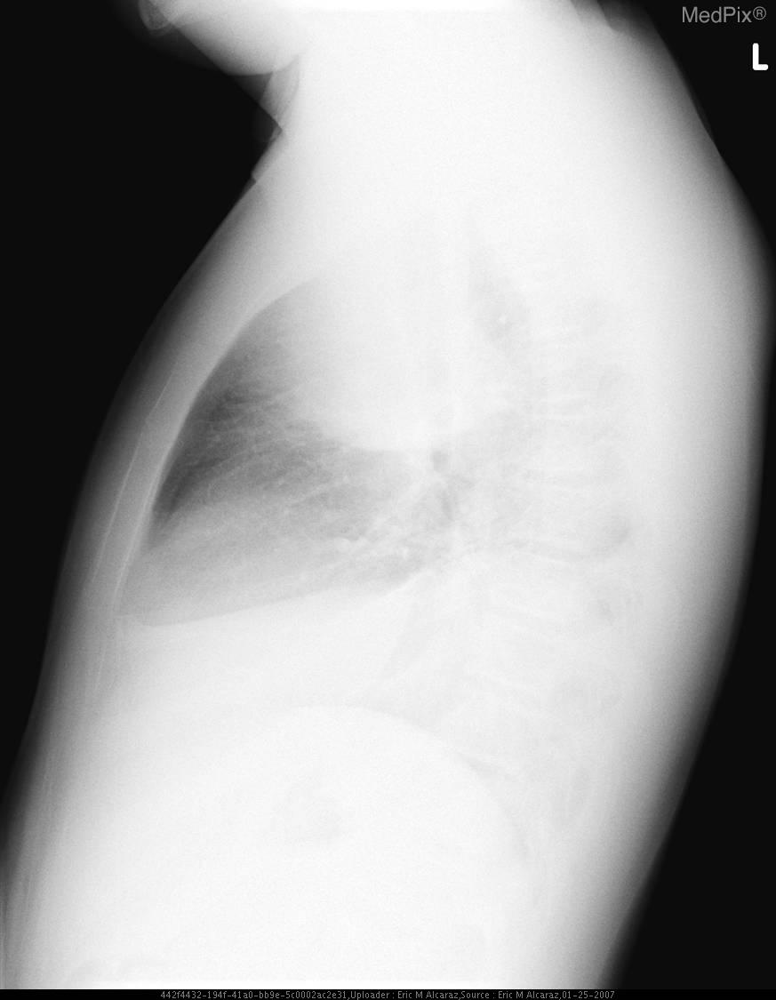  |   |
| 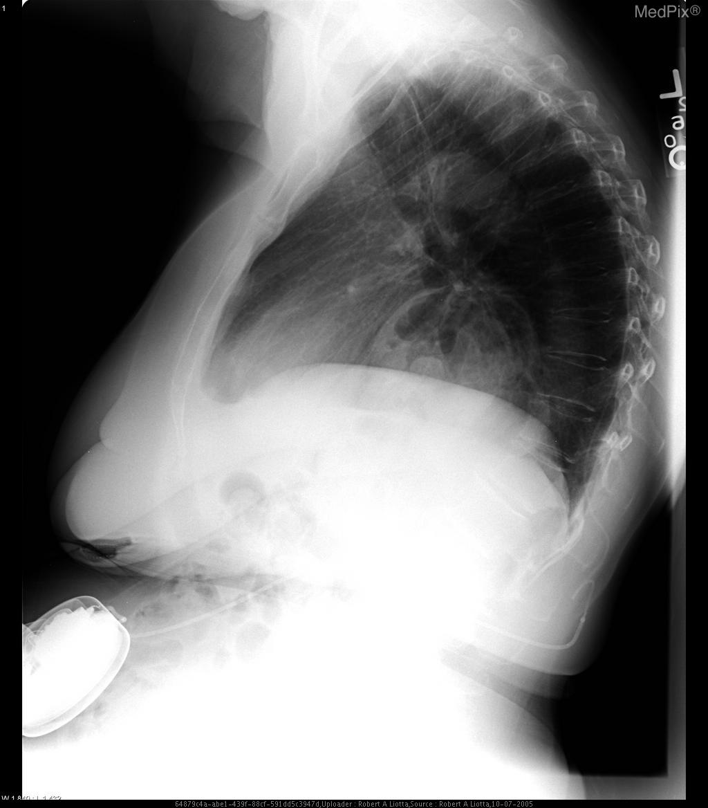  |   |

It's not really necessary apply only the gaussian filter in order to get the unsharpened mask. In fact, the project also tested another filters studied at class:

| Original Image  | Gaussian Filter | Median Filter | Maximum Filter | Minimum Filter |
| ------------- | ------------- | ------------- | ------------- | ------------- |
|   |  |  | 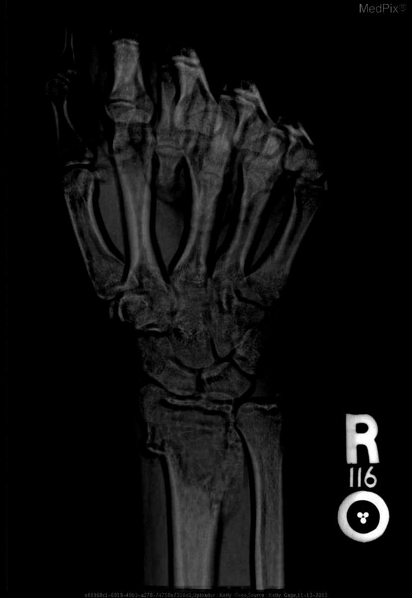 |  |


## High-frequency Emphasis filtering

High-frequency Emphasis filtering is a technique that uses Gaussian High Pass Filter to emphasis and accentuate the edges. The edges tend to be expressed in the high-frequency spectrum since they have more drastic changes of intensity. This technique produce a low contrast image and the use of Histogram Equalization is required to increase both sharpness and contrast.

The first step of the algorithm is to copy the original image and apply a gaussian high pass filter into it (Sharpness intensity is defined by a setting called **Radius**).\
Then we add the high-frequency filter to the original image.
Finally, the contrast of the image will be adjusted with simple Histogram Equalization: 
```
sharpened image = (original image + (Gaussian Highpass Filter)) * (Histogram Equalization)
```

### Results

| Original Image  | Enhanced Image |
| ------------- | ------------- |
| 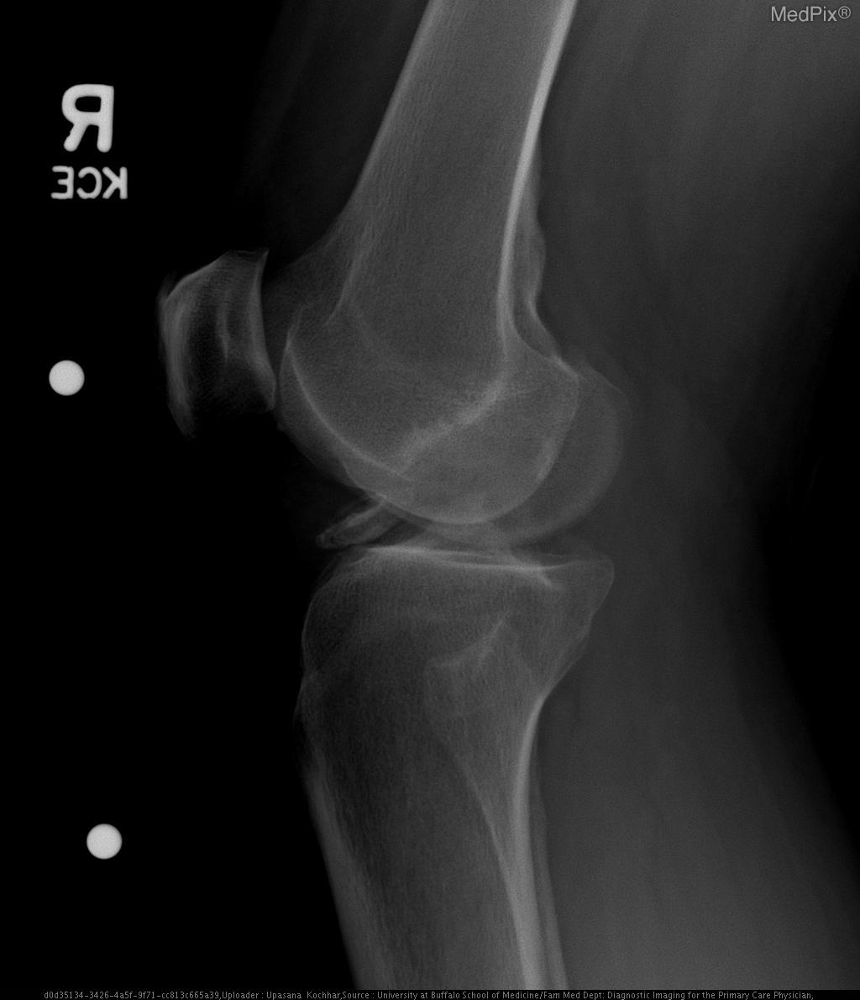  | 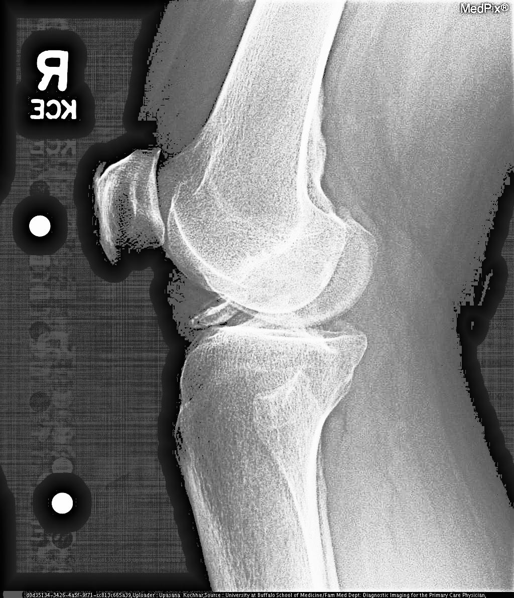  |
| 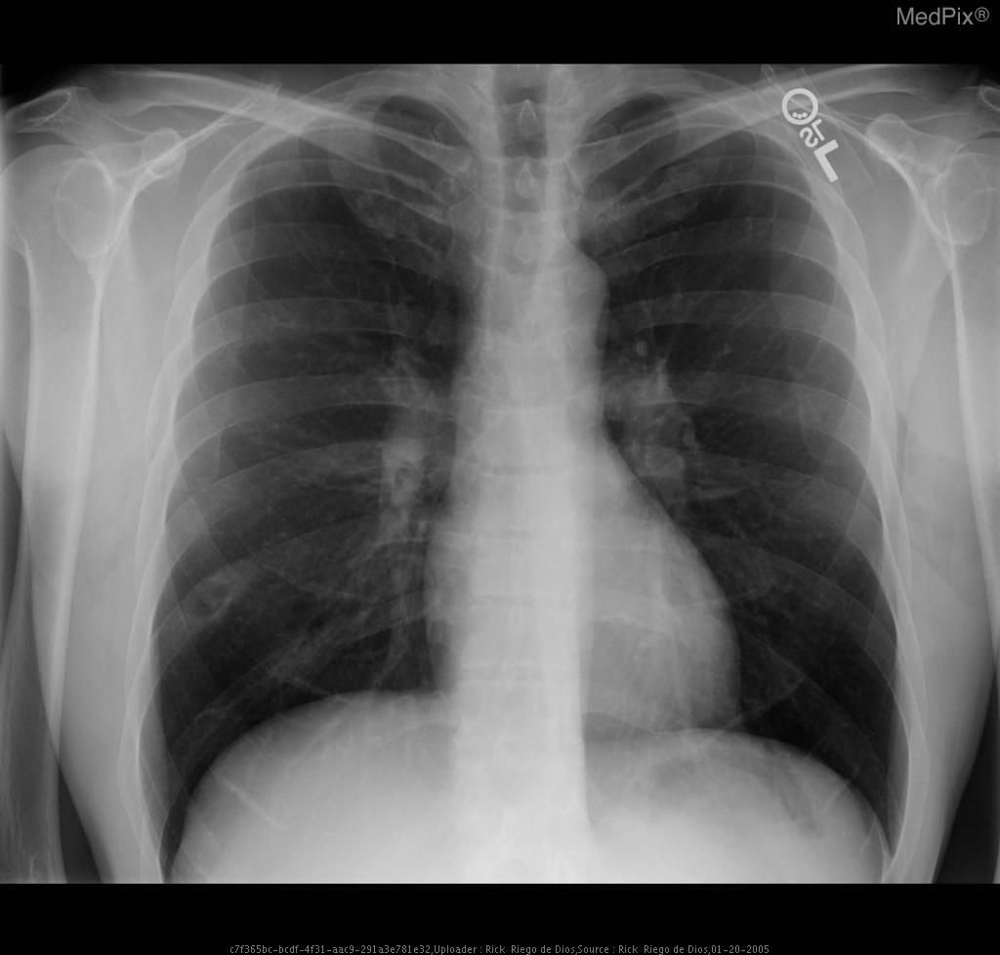  |   |
| 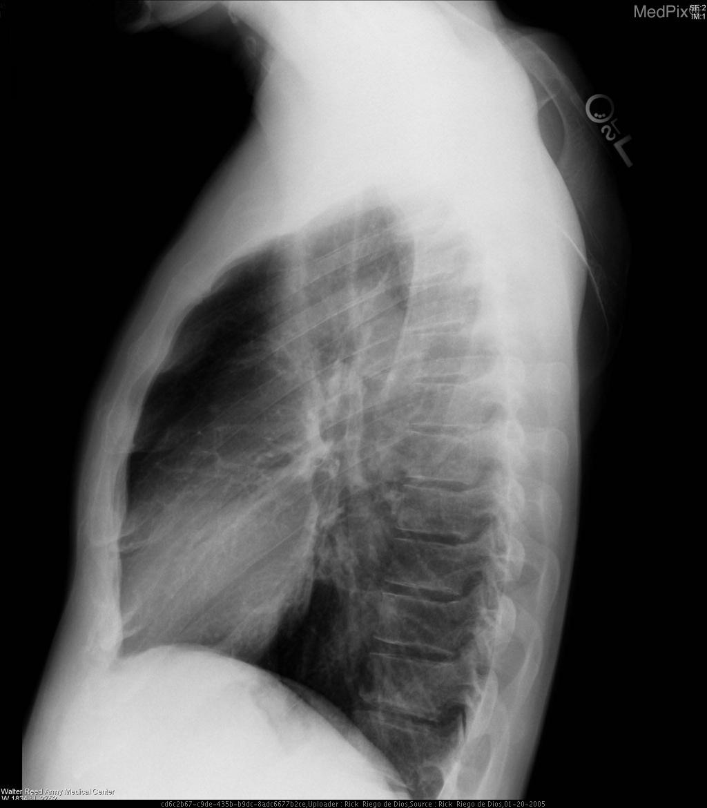  | 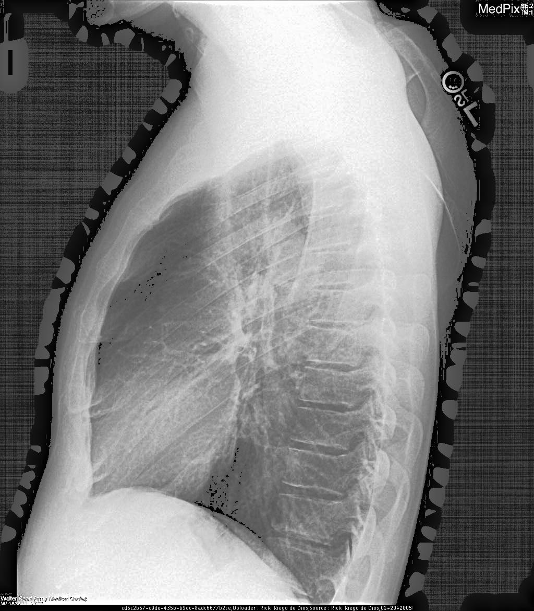  |


## Conclusion

For our algorithm's comparisons, we will use a [Toddler's Fracture of a Left Tibia](https://medpix.nlm.nih.gov/case?id=118ab4b1-3fa7-4ce8-b332-6b6ce0632d90) from a 3 years old pacient. Children ofter have injuries of the tibia and fibula in their lower limbs. 

| Original | UM  | HEF | CLAHE |
| ------------- | ------------- | ------------- | ------------- |
 |  | 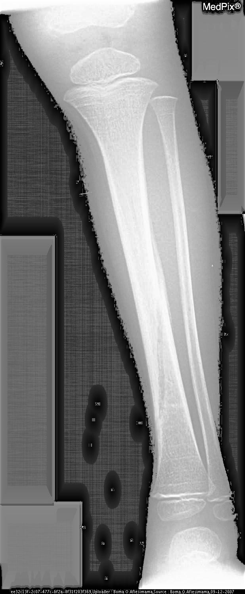 |  |

Two other images from the same case, a [Nonossifying Fibroma](https://medpix.nlm.nih.gov/case?id=410b3692-dd34-47f5-a97d-4b422ca02a96) from someone who got kicked in the shin while playing soccer, can also be used to check our results.

| Original | UM  | HEF | CLAHE |
| ------------- | ------------- | ------------- | ------------- |
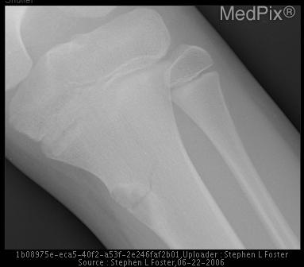 |  | 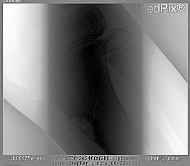 | SOON |

| Original | UM  | HEF | CLAHE |
| ------------- | ------------- | ------------- | ------------- |
 |  |  | SOON |

## Authors

- André Scheibel de Almada 9292952
- Cho Young Lim 6436060
- Eduardo Garcia Misiuk 9293230

# Dependencies
## Packages
### Python
`apt-get install python3`

### venv
`apt-get install python3-venv`

## Libraries
Setup the repository by following the instructions from [installation](installation) section.  
After activating the environment, run `pip install -r requirements.txt` to install the libraries.

# Installation
Clone the repository with `git clone https://github.com/asalmada/x-ray-images-enhancement`.  
Run `python3 -m venv x-ray-images-enhancement` to install the environment in the repository.

## Environment
To activate, run `source bin/activate` in Linux or `source Scripts/activate` in Windows.  
To deactivate, run `deactivate`.

# Demonstration
To run the demonstration, run `chmod 755 demo.sh` and then `./demo.sh`.